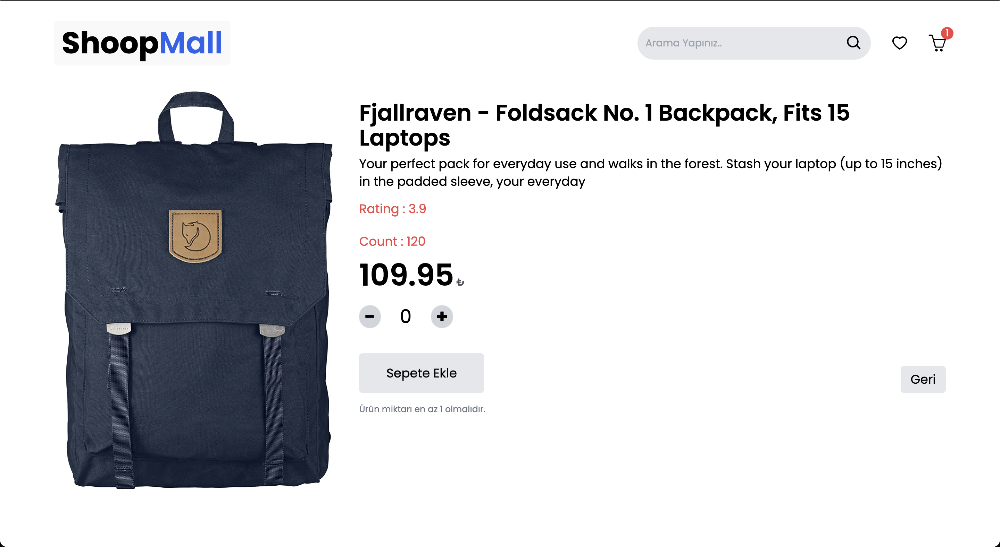

# Shopping Cart Application

This project is a shopping cart application built with **React** and **Vite** using **JavaScript**. It demonstrates the implementation of state management using **Redux Toolkit** and asynchronous operations managed with **Redux Thunk**.

## Screenshots 🖼️

### Video GIF


### Homepage


_(Main page displaying products)_

### Movie Details Page

(View detailed information about the selected products)

_(Shows detailed products information such as price, Count, and more.)_

### Favorites Page

## **Features**

- State management with **Redux Toolkit**.
- Asynchronous operations and API data fetching using **Redux Thunk**.
- **React Router DOM** for routing between pages.
- **React-Paginate** for pagination.
- UI components styled with **TailwindCSS**.
- Icons implemented with **React-Icons**.
- **React-Slick** and **React-Carousel** for carousels/sliders.
- Data fetching from [Fake Store API](https://fakestoreapi.com).

## **Project Setup**

## Installation

1. Clone the repository:
   ```
   git clone https://github.com/ozerbaykal/Shop-Mall-Toolkit.git
   cd Movie-App
   ```
2. Install dependencies:

```
npm install

```

3. Run the development server:

```
npm run dev

```

## Contributing

Contributions are welcome! Please open an issue first to discuss what you would like to change.

- 1.Fork the project
- 2.Create your feature branch (git checkout -b feature/NewFeature)
- 3.Commit your changes (git commit -m 'Add new feature')
- 4.Push to the branch (git push origin feature/NewFeature)
- 5.Open a Pull Request

## Contact 📬

**Özer BAYKAL**  
Email: [baykalozer87@gmail.com](mailto:baykalozer87@gmail.com)  
Project Link: [Movie App on GitHub](https://github.com/ozerbaykal/Shop-Mall-Toolkit)
